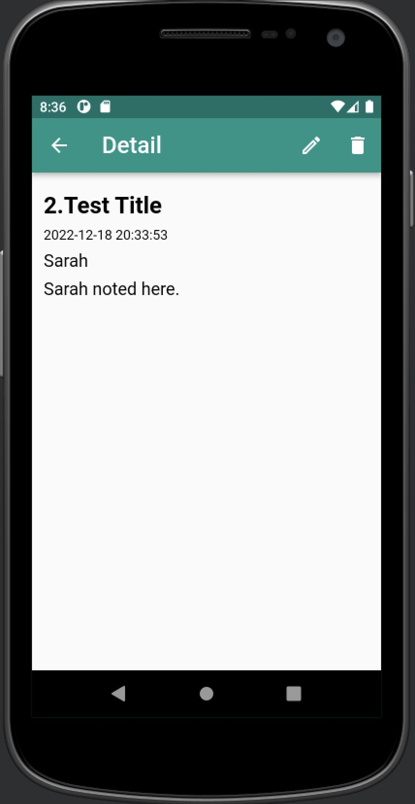
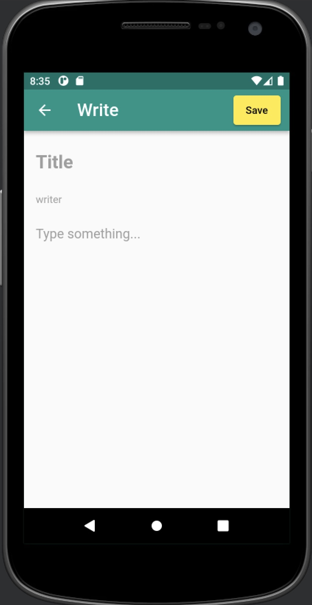
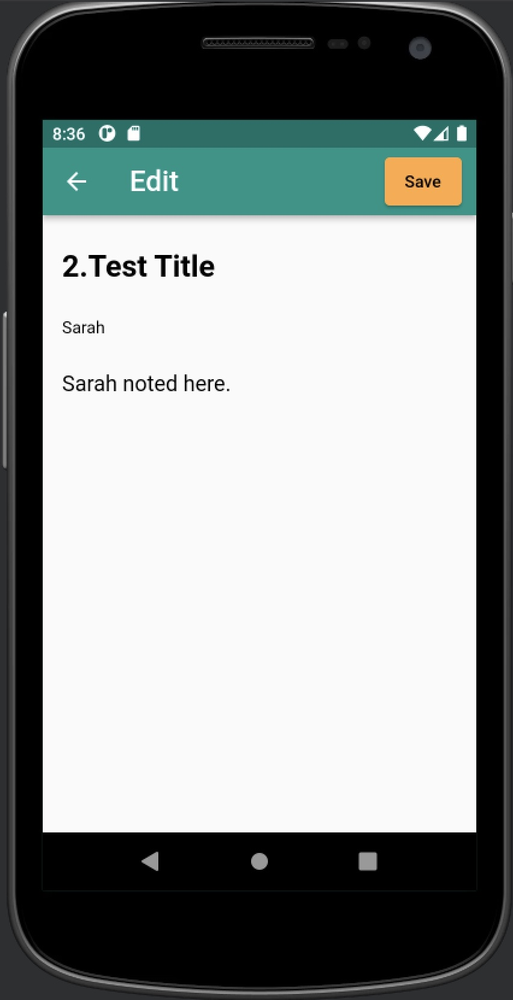
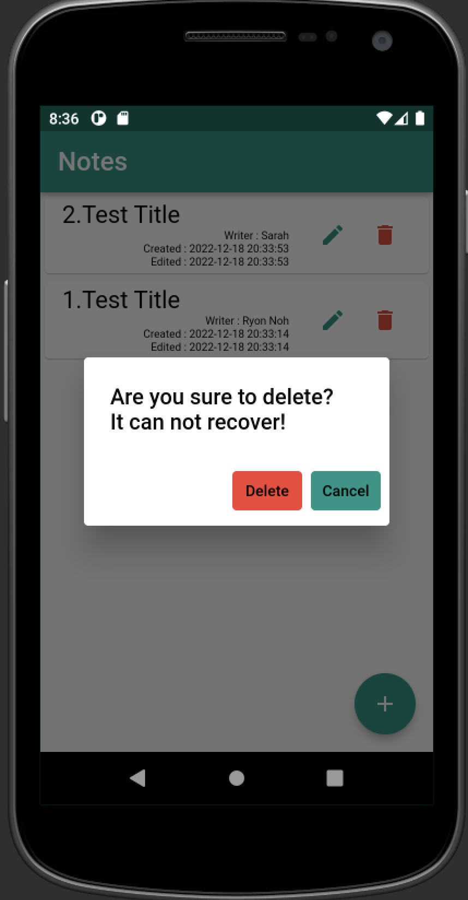

## note_app
- Note App using sqflite CRUD.

## Flutter pub get
$ flutter pub get

## Flutter package install
$ flutter pub add sqflite  
$ flutter pub add logger

## Images 
1. List, Detail  

  
2. Write, Edit  

  
3. Delete  

 
